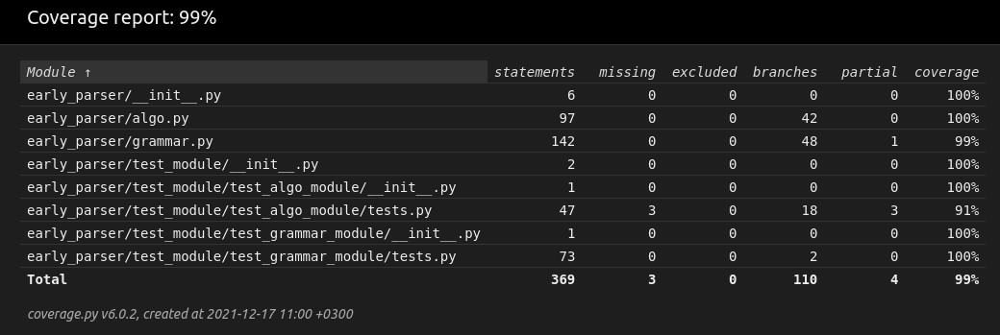

# Realization of Earley's algorithm
# Task
> It is necessary to implement the algorithm in the form of an Algo class, which has the following methods:
> 
> fit(G: Grammar) ! Algo - preprocessing
  
> predict(word: String) ! Boolean - checking whether a word belongs to the language.
  
> Additionally, it is necessary to implement testing of the built preprocessing.
  Algorithms for implementation

> 1. Earley's algorithm
> 2. LR(1)-algorithm
> Since there is no preprocessing in Earley's algorithm, it is necessary to implement the functions:
  
>  • Scan(conf: Configuration, letter: char) ! Set• Predict(...)

>  • Complete(...) - think over the interface in such a way that the result can be read-
  test. 
# Description of the algorithm
> You can find it in docs/Formal_Languages__Colloquium_2021.pdf

# Testing, coverage
> These results are obtained on the basis of branch testing

> early_parser/grammar.py have 99% because there are raising exception in _Iterator 

> If you want to see coverage code, do this commands:
```bash
coverage run --branch -m unittest early_parser.test_module
coverage html
```
> Wrote HTML report to htmlcov/index.html



# Summary

 Members                        | Descriptions                                
--------------------------------|---------------------------------------------
`namespace `[`early_parser::algo`](#namespaceearly__parser_1_1algo) | 
`namespace `[`early_parser::grammar`](#namespaceearly__parser_1_1grammar) | 
`class `[`early_parser::grammar::Grammar::_Iterator`](#classearly__parser_1_1grammar_1_1Grammar_1_1__Iterator) | Standard bidirectional Iterator for [Grammar](#classearly__parser_1_1grammar_1_1Grammar).
`class `[`early_parser::algo::Algo::_State`](#classearly__parser_1_1algo_1_1Algo_1_1__State) | Metaclass that implements a state inside a certain rule

# namespace `early_parser::algo` 

## Summary

 /Members                        | Descriptions                                
--------------------------------|---------------------------------------------
`class `[`early_parser::algo::Algo`](#classearly__parser_1_1algo_1_1Algo) | Realization of Earley algorithm.

# class `early_parser::algo::Algo` 

Realization of Earley algorithm.

## Summary

 Members                        | Descriptions                                
--------------------------------|---------------------------------------------
`public def `[`__init__`](#classearly__parser_1_1algo_1_1Algo_1a979bd29820a57d68ec4ed9bc0a4ec50a)`(self,`[`Grammar`](#classearly__parser_1_1grammar_1_1Grammar)` grammar)` | The constructor of Algo
`public bool `[`complete`](#classearly__parser_1_1algo_1_1Algo_1a9da3a9c7b625f40126af81d0624a177b)`(self,int _id)` | The main complete method
`public bool `[`has_word`](#classearly__parser_1_1algo_1_1Algo_1af419b631d35967aafd5768f82224e501)`(self,str word)` | Checks the presence of a word in the grammar
`public bool `[`predict`](#classearly__parser_1_1algo_1_1Algo_1a30c9e0a7e5152029231b4eeff5f5007a)`(self,int _id)` | The main predict method
`public def `[`scan`](#classearly__parser_1_1algo_1_1Algo_1af5dd681b5fb82f2c8d3770138d303670)`(self,int _id,str s)` | The main scan method

## Members

#### `public def `[`__init__`](#classearly__parser_1_1algo_1_1Algo_1a979bd29820a57d68ec4ed9bc0a4ec50a)`(self,`[`Grammar`](#classearly__parser_1_1grammar_1_1Grammar)` grammar)` 

The constructor of Algo

#### `public bool `[`complete`](#classearly__parser_1_1algo_1_1Algo_1a9da3a9c7b625f40126af81d0624a177b)`(self,int _id)` 

The main complete method

#### `public bool `[`has_word`](#classearly__parser_1_1algo_1_1Algo_1af419b631d35967aafd5768f82224e501)`(self,str word)` 

Checks the presence of a word in the grammar
 param word given word
 return True if there is
 return False if there isn't

#### `public bool `[`predict`](#classearly__parser_1_1algo_1_1Algo_1a30c9e0a7e5152029231b4eeff5f5007a)`(self,int _id)` 

The main predict method

#### `public def `[`scan`](#classearly__parser_1_1algo_1_1Algo_1af5dd681b5fb82f2c8d3770138d303670)`(self,int _id,str s)` 

The main scan method

# namespace `early_parser::grammar` 

## Summary

 Members                        | Descriptions                                
--------------------------------|---------------------------------------------
`public bool `[`is_non_terminal`](#namespaceearly__parser_1_1grammar_1ab92177a919205a6addcbd088d132a168)`(str c)`            | Checks the symbol for non-terminal param c symbol return: True is non-terminal return: False is terminal.
`public bool `[`is_symbol`](#namespaceearly__parser_1_1grammar_1a2f2d762c2d29c7432af3816b6f3496ca)`(str c)`            | Checks belonging of the symbol to the alphabet param c symbol return: True is in alphabet return: False not in the alphabet.
`public bool `[`is_valid_rule`](#namespaceearly__parser_1_1grammar_1a8579fcff0794fd09f899e1c5b66267e4)`(str rule)`            | Checks validity of rules param rule given rules return True if valid return False if not valid.
`public bool `[`is_valid_single_rule`](#namespaceearly__parser_1_1grammar_1a9a637f0e5ab71e4bba6daec76d81861e)`(str rule)`            | Checks validity of a separate rule param rule given rule return True if valid return False if not valid.
`public list `[`parse_rules`](#namespaceearly__parser_1_1grammar_1a82e4ec13fa1bbf0edd01046384a15d45)`(str rule)`            | Section: Work with rules.
`class `[`early_parser::grammar::Grammar`](#classearly__parser_1_1grammar_1_1Grammar) | Section: Work with [Grammar](#classearly__parser_1_1grammar_1_1Grammar).

## Members

#### `public bool `[`is_non_terminal`](#namespaceearly__parser_1_1grammar_1ab92177a919205a6addcbd088d132a168)`(str c)` 

Checks the symbol for non-terminal param c symbol return: True is non-terminal return: False is terminal.

#### `public bool `[`is_symbol`](#namespaceearly__parser_1_1grammar_1a2f2d762c2d29c7432af3816b6f3496ca)`(str c)` 

Checks belonging of the symbol to the alphabet param c symbol return: True is in alphabet return: False not in the alphabet.

#### `public bool `[`is_valid_rule`](#namespaceearly__parser_1_1grammar_1a8579fcff0794fd09f899e1c5b66267e4)`(str rule)` 

Checks validity of rules param rule given rules return True if valid return False if not valid.

#### `public bool `[`is_valid_single_rule`](#namespaceearly__parser_1_1grammar_1a9a637f0e5ab71e4bba6daec76d81861e)`(str rule)` 

Checks validity of a separate rule param rule given rule return True if valid return False if not valid.

#### `public list `[`parse_rules`](#namespaceearly__parser_1_1grammar_1a82e4ec13fa1bbf0edd01046384a15d45)`(str rule)` 

Section: Work with rules.

Splits several rules written in one line into separate ones param rule given rules return rules list of split rules

# class `early_parser::grammar::Grammar` 

Section: Work with [Grammar](#classearly__parser_1_1grammar_1_1Grammar).

Realization of Context-free [Grammar](#classearly__parser_1_1grammar_1_1Grammar)

## Summary

 Members                        | Descriptions                                
--------------------------------|---------------------------------------------
`public def `[`__init__`](#classearly__parser_1_1grammar_1_1Grammar_1a5fb051c8784ea6338ebcee41c4d38139)`(self,str start)` | Constructor.
`public def `[`__iter__`](#classearly__parser_1_1grammar_1_1Grammar_1a45163c19b7c87f553c6f1d055d4668cb)`(self)` | Redefining of method 'iter' by class _Iterator
`public int `[`__len__`](#classearly__parser_1_1grammar_1_1Grammar_1a5fa3fce343eed37d38c208516f6f875b)`(self,str c)` | Outputs size of object param c non-term return size of container.
`public def `[`__repr__`](#classearly__parser_1_1grammar_1_1Grammar_1a9a47563093dfc5ba12274b66e368920c)`(self)` | This method allow to convert grammar to string !!! This method wasn't tested !!!
`public def `[`__str__`](#classearly__parser_1_1grammar_1_1Grammar_1a23e8041ce1015febe4fdace3225714f9)`(self)` | This method allow to output grammar to stdout !!! This method wasn't tested !!!
`public bool `[`add_rule`](#classearly__parser_1_1grammar_1_1Grammar_1af1ff1f04064b8e10ddaa6d14510f89ec)`(self,str rule)` | Add rule to grammar param rule given rule return True correctly added return False wasn't added.
`public def `[`del_similar_rules`](#classearly__parser_1_1grammar_1_1Grammar_1a6346443a6a4f8fdb90cc82dc8bee5719)`(self)` | Delete similar rules from grammar For this uses container - set.
`public def `[`erase_rule`](#classearly__parser_1_1grammar_1_1Grammar_1a761221323a75061309b1df0d0681b44b)`(self,`[`_Iterator`](#classearly__parser_1_1grammar_1_1Grammar_1_1__Iterator)` it)` | Deleting rule by iterator param it iterator return iterator to the next element.
`public def `[`get_start`](#classearly__parser_1_1grammar_1_1Grammar_1afa8749a569f6a1c70b7c35337e2a7000)`(self)` | Get first nonTerminal in grammar.
`public def `[`input_init`](#classearly__parser_1_1grammar_1_1Grammar_1a34eeb920ef7666d32ba2d7f71a4b5341)`(self)` | Input the grammar from stdin !!! This method wasn't tested !!!

## Members

#### `public def `[`__init__`](#classearly__parser_1_1grammar_1_1Grammar_1a5fb051c8784ea6338ebcee41c4d38139)`(self,str start)` 

Constructor.

#### `public def `[`__iter__`](#classearly__parser_1_1grammar_1_1Grammar_1a45163c19b7c87f553c6f1d055d4668cb)`(self)` 

Redefining of method 'iter' by class _Iterator

#### `public int `[`__len__`](#classearly__parser_1_1grammar_1_1Grammar_1a5fa3fce343eed37d38c208516f6f875b)`(self,str c)` 

Outputs size of object param c non-term return size of container.

#### `public def `[`__repr__`](#classearly__parser_1_1grammar_1_1Grammar_1a9a47563093dfc5ba12274b66e368920c)`(self)` 

This method allow to convert grammar to string !!! This method wasn't tested !!!

#### `public def `[`__str__`](#classearly__parser_1_1grammar_1_1Grammar_1a23e8041ce1015febe4fdace3225714f9)`(self)` 

This method allow to output grammar to stdout !!! This method wasn't tested !!!

#### `public bool `[`add_rule`](#classearly__parser_1_1grammar_1_1Grammar_1af1ff1f04064b8e10ddaa6d14510f89ec)`(self,str rule)` 

Add rule to grammar param rule given rule return True correctly added return False wasn't added.

#### `public def `[`del_similar_rules`](#classearly__parser_1_1grammar_1_1Grammar_1a6346443a6a4f8fdb90cc82dc8bee5719)`(self)` 

Delete similar rules from grammar For this uses container - set.

#### `public def `[`erase_rule`](#classearly__parser_1_1grammar_1_1Grammar_1a761221323a75061309b1df0d0681b44b)`(self,`[`_Iterator`](#classearly__parser_1_1grammar_1_1Grammar_1_1__Iterator)` it)` 

Deleting rule by iterator param it iterator return iterator to the next element.

#### `public def `[`get_start`](#classearly__parser_1_1grammar_1_1Grammar_1afa8749a569f6a1c70b7c35337e2a7000)`(self)` 

Get first nonTerminal in grammar.

#### `public def `[`input_init`](#classearly__parser_1_1grammar_1_1Grammar_1a34eeb920ef7666d32ba2d7f71a4b5341)`(self)` 

Input the grammar from stdin !!! This method wasn't tested !!!

# class `early_parser::grammar::Grammar::_Iterator` 

Standard bidirectional Iterator for [Grammar](#classearly__parser_1_1grammar_1_1Grammar).

## Summary

 Members                        | Descriptions                                
--------------------------------|---------------------------------------------
`public def `[`__init__`](#classearly__parser_1_1grammar_1_1Grammar_1_1__Iterator_1a34584ef1aeb0931db004e19c350472cd)`(self,`[`rules`](#classearly__parser_1_1grammar_1_1Grammar_1_1__Iterator_1a595e07a99f60f22a6a29e4fca291ea28)`,c)` | Constructor.
`public def `[`__iter__`](#classearly__parser_1_1grammar_1_1Grammar_1_1__Iterator_1a45163c19b7c87f553c6f1d055d4668cb)`(self)` | Realization of iteration in grammar.
`public def `[`__next__`](#classearly__parser_1_1grammar_1_1Grammar_1_1__Iterator_1a71d9958aa7271de5bb07b861c559d970)`(self)` | Redefining of method 'next'.
`public def `[`get_rule`](#classearly__parser_1_1grammar_1_1Grammar_1_1__Iterator_1aa5b2b44bad2a6a1ca9e29c0d3c05e854)`(self)` | Get the rule by iterator.
`public def `[`is_valid`](#classearly__parser_1_1grammar_1_1Grammar_1_1__Iterator_1ac75859e6cb7891dea32afc9f89a909a5)`(self)` | Checks whether the iterator is valid.

## Members

#### `public def `[`__init__`](#classearly__parser_1_1grammar_1_1Grammar_1_1__Iterator_1a34584ef1aeb0931db004e19c350472cd)`(self,`[`rules`](#classearly__parser_1_1grammar_1_1Grammar_1_1__Iterator_1a595e07a99f60f22a6a29e4fca291ea28)`,c)` 

Constructor.

#### `public def `[`__iter__`](#classearly__parser_1_1grammar_1_1Grammar_1_1__Iterator_1a45163c19b7c87f553c6f1d055d4668cb)`(self)` 

Realization of iteration in grammar.

#### `public def `[`__next__`](#classearly__parser_1_1grammar_1_1Grammar_1_1__Iterator_1a71d9958aa7271de5bb07b861c559d970)`(self)` 

Redefining of method 'next'.

#### `public def `[`get_rule`](#classearly__parser_1_1grammar_1_1Grammar_1_1__Iterator_1aa5b2b44bad2a6a1ca9e29c0d3c05e854)`(self)` 

Get the rule by iterator.

#### `public def `[`is_valid`](#classearly__parser_1_1grammar_1_1Grammar_1_1__Iterator_1ac75859e6cb7891dea32afc9f89a909a5)`(self)` 

Checks whether the iterator is valid.

# class `early_parser::algo::Algo::_State` 

Metaclass that implements a state inside a certain rule

## Summary

 Members                        | Descriptions                                
--------------------------------|---------------------------------------------
`public def `[`__eq__`](#classearly__parser_1_1algo_1_1Algo_1_1__State_1ad794ff077f2f05f228a7109f3670ac40)`(self,other)` | Redefining the method '=='
`public def `[`__hash__`](#classearly__parser_1_1algo_1_1Algo_1_1__State_1a3195ea87162f33a34d0079931a8194ca)`(self)` | Redefining the hash method
`public def `[`__init__`](#classearly__parser_1_1algo_1_1Algo_1_1__State_1a69e2d73e3e17ce29769363bccd5e8b61)`(self,str rule,int rule_pos,int str_pos)` | The constructor of _State

## Members

#### `public def `[`__eq__`](#classearly__parser_1_1algo_1_1Algo_1_1__State_1ad794ff077f2f05f228a7109f3670ac40)`(self,other)` 

Redefining the method '=='

#### `public def `[`__hash__`](#classearly__parser_1_1algo_1_1Algo_1_1__State_1a3195ea87162f33a34d0079931a8194ca)`(self)` 

Redefining the hash method

#### `public def `[`__init__`](#classearly__parser_1_1algo_1_1Algo_1_1__State_1a69e2d73e3e17ce29769363bccd5e8b61)`(self,str rule,int rule_pos,int str_pos)` 

The constructor of _State

Generated by [Moxygen](https://sourcey.com/moxygen)